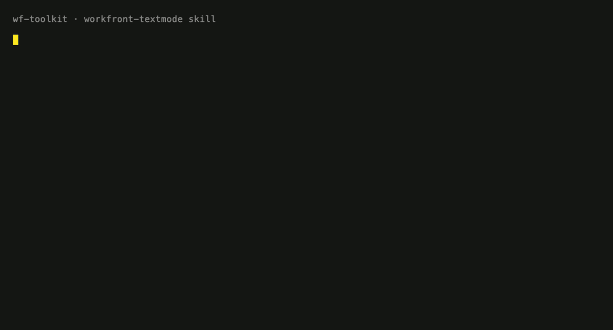

# wf-toolkit





Workfront skills for Claude — reference knowledge and working recipes for Adobe Workfront admins, developers, and consultants. Two ways to use any skill:

- **Route A — Claude Code plugin** (Desktop app, terminal CLI, or IDE extension). Recommended: skills auto-trigger, scripts run locally, and API keys never enter chat.
- **Route B — Claude.ai Project** (chat with uploaded knowledge files). Fallback for chat-only use; requires pasting keys into chat for API work.

One source of truth per topic — `knowledge/<topic>/` and `examples/<topic>/` power both routes.

## Skills

Every skill lives at `skills/<name>/`. Version history is in `CHANGELOG.md`.

| Skill | The time it saves | Claude.ai Project |
|---|---|---|
| `workfront-textmode` | Views, filters, groupings, `valueexpression` — without the trial-and-error loop text mode usually costs | `claude-projects/textmode/` |
| `workfront-api` | Auth, `/search` filters, EXISTS queries, pagination, External Lookup — the undocumented wire formats included | `claude-projects/api/` |
| `workfront-calc-fields` | Calculated-field syntax that persists on records — not the report-time expressions it gets confused with | `claude-projects/calculated-fields/` |
| `workfront-custom-forms` | Forms, 200-option dropdowns, display logic, cross-tenant clones — including the writes that 400 without the right envelope | `claude-projects/custom-forms/` |
| `workfront-permissions` | "Why can't X edit Y?" answered by walking the actual permission graph, read-only | `claude-projects/permissions/` |
| `workfront-business-rules` | Validation and automation rules (`IF()` block-on-save) authored and debugged | — (Route A only) |
| `workfront-reports` | Reports created, modified, and cloned via the API — schema discovered at runtime | `claude-projects/reports/` |

Skills that touch your Workfront instance read credentials from `~/wf-envs/<active>/.env` via a shell wrapper — under Route A, no API key ever enters chat. See "Environments" below.

## Route A setup — Claude Code

The plugin works identically in three places, which share one install under `~/.claude/`: the **Claude Desktop app** (Mac/Windows), the **Claude Code CLI** in a terminal, and **IDE extensions** (VS Code, JetBrains). Pick whichever you prefer. The web app at `claude.ai/code` is **not** supported — it runs in a remote sandbox without access to your local files.

You don't need to clone this repo. Claude Code installs the plugin straight from GitHub.

**Desktop app (point-and-click):**

1. Open the **Claude Desktop app** and sign in.
2. In the left sidebar, click the **`</> Code`** tab.
3. Click **Customize**, then under **Personal plugins** click **+**.
4. Click **Create plugin ▸**, then **Add Marketplace**.
5. Paste `Thousand-Cuts/wf-toolkit` into the input field and click **Sync**.

**Terminal CLI or IDE extension (slash commands):**

```
/plugin marketplace add Thousand-Cuts/wf-toolkit
/plugin install wf-toolkit@wf-toolkit
/reload-plugins
```

One install brings every skill. No restart needed.

### Using the skills

You don't invoke skills explicitly — ask naturally and the right one auto-triggers ("how do I write a text mode filter for active projects?" → `workfront-textmode`). Slash commands like `/wf-env-use` work in the Desktop app's chat input too.

Two Desktop-app notes:

- **Permission prompts.** When a skill runs a shell command, the app asks for approval. `curl` against `*.workfront.com` or scripts under `skills/` are normal; review anything unfamiliar before allowing.
- **Interactive scripts need a real terminal.** A few setup scripts prompt for hidden input (API keys) and can't run inside the chat panel. When you hit one, the skill gives you the exact command to copy into the Terminal app.

### Updating

After a new version lands, run (in any Claude Code session, Desktop app included):

```
/plugin marketplace update wf-toolkit
/reload-plugins
```

To update automatically instead: run `/plugin`, Tab to the **Marketplaces** tab, select `wf-toolkit`, choose **Enable auto-update**.

## Environments

Skills that hit your Workfront instance read from `~/wf-envs/<slug>/.env` — one folder per environment of your instance (`prod`, `preview`, `sandbox`). The API key is entered via hidden terminal input and never touches Claude's context.

- **Add an environment:** use `/wf-env-add` — it walks you through it and hands you the exact one-line terminal command to run. (The setup script is `skills/_shared/scripts/wf-env-setup.sh` inside the installed plugin; `${CLAUDE_PLUGIN_ROOT}` only resolves inside a Claude Code session, so ask Claude for the installed path if you want to run it by hand.) It asks for label, host, env type (`preview` / `sandbox` / `prod`), read-only mode, optional default-user email, and the API key (hidden input), then creates the folder tree, writes the `.env`, validates the key, and activates the environment — one pass.
- **Switch active environment:** `/wf-env-use <slug>` (no argument lists environments).
- **List everything:** `/wf-env-list`.
- **Remove an environment:** `/wf-env-remove <slug>` — requires retyping the slug; refuses to delete a non-empty `exports/` unless you pass `--force-keep-exports` (which archives it first).

**Safety:** `.env` files are mode 600 in mode-700 folders, and the wrapper refuses to source a file whose permissions drift. Writes to a `prod` environment require an explicit acknowledgment (`WF_ENV_WRITE_ACK=1` prefixed to the command batch, after you confirm the write) — there is no pre-registered bypass. The folder sits at `~/wf-envs/` for discoverability, not secrecy — don't open it in screenshares.

## Route B setup — Claude.ai chat

Claude.ai can't pull from GitHub — you upload knowledge files once into a per-topic Project (any plan; Projects work on Free through Enterprise).

1. Get the files locally: open [the repo](https://github.com/Thousand-Cuts/wf-toolkit) in your browser → green **Code** button → **Download ZIP** → unzip.
2. Open your topic's folder under `claude-projects/` and follow its `SETUP.md`.

One Project per topic. For every topic except `textmode`, `api`, and `calculated-fields`, Route A is strongly preferred — those skills lean on local scripts that chat can't run. When knowledge files change in the repo, re-download and re-upload them (no auto-sync).

## Repo map

| Path | Purpose |
|---|---|
| `knowledge/` | Source-of-truth reference content, bucketed by topic |
| `examples/` | Ready-to-paste snippets, bucketed by topic |
| `claude-projects/` | Per-topic Claude.ai Project recipes (instructions + SETUP) |
| `.claude-plugin/` | Plugin manifest + marketplace config |
| `skills/` | Claude Code skills (one folder per skill) |
| `commands/` | Slash commands (`/wf-env-add`, `/wf-env-use`, …) |
| `tests/` | pytest + shell smoke tests for skill scripts |

## Contributing

**Found the docs diverging from live behavior?** Open a [GitHub issue](https://github.com/Thousand-Cuts/wf-toolkit/issues) with the endpoint, API version, date, and observed vs. documented behavior. Divergences are often environment-specific (Workfront version, package, configuration), so they get confirmed in the issue queue before verified fixes land in a release. Fork-and-PR contributions are welcome too — the issue is just the default path.

When adding to an existing skill:

- Sanitize examples — no real custom field names, project names, role IDs, or user IDs from any tenant.
- Test text-mode snippets in a sandbox or non-production report before adding them to `examples/`.
- Log changes in `CHANGELOG.md`.

When adding a new skill:

1. Add `knowledge/<topic>/` and `examples/<topic>/`.
2. Add `claude-projects/<topic>/project-instructions.md` and `SETUP.md`.
3. Add `skills/workfront-<topic>/SKILL.md` with a topic-specific trigger.
4. Update the skills table above, bump the plugin version, and log in `CHANGELOG.md`.

**Releases:** plugin updates only reach users when `version` in `.claude-plugin/plugin.json` is bumped (semver: patch for fixes, minor for new skills/features, major for breaking changes). A push without a version bump triggers no user-facing update, even with auto-update enabled.

## Disclaimer

Community resource, not an official Adobe product. Always verify syntax against the [Adobe Experience League documentation](https://experienceleague.adobe.com/docs/workfront.html) and test in a non-production environment before deploying.

## License

MIT — see `LICENSE`.

## Finding reports

Workfront's real behavior outruns its documentation. When a session runs into
behavior the knowledge files don't cover, file a
[finding report](../../issues/new?template=finding-report.yml) — what was
attempted, what the docs claimed, what actually happened. Findings are
verified against a live tenant before they enter the knowledge files, so the
record stays trustworthy. The verified-gotcha convention this repo uses is
described in [the field report that introduced it](https://thousandcuts.ai/guides/workfront-mcp-claude).

## If it saved you an hour

A star helps other Workfront admins find this. That's the whole ask.

## Maintained by

[Thousand Cuts](https://thousandcuts.ai/toolkit) — AI automation for creative and
marketing operations. The toolkit's private tier (platform assessment, bulk-write
safety harness, Fusion audit rules) is part of our delivery practice.
